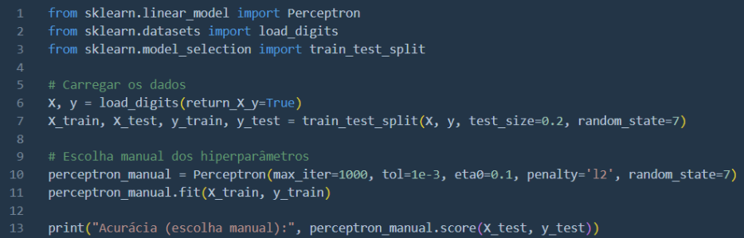
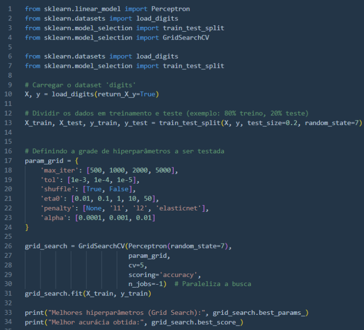
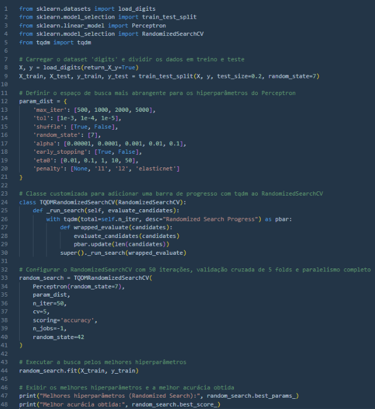

# Seleção de hiperparâmetros em Machine Learning: escolha manual, Grid Search e Randomized Search.

 

  

 

A ideia de pesquisar e escrever este artigo surgiu ao assistir o início de uma das excelentes aulas do [Lucas Lattari](https://github.com/lucaslattari), no curso **Redes Neurais e Deep Learning com Python** — um dos cursos que faço atualmente. (Obrigado, Lucas!)

## Resumo

O desempenho de um modelo de Machine Learning depende fortemente da escolha correta dos hiperparâmetros, que são configurações estabelecidas a priori e que não são aprendidas a partir dos dados.

Este artigo explora, de maneira técnica e didática, três abordagens para a seleção de hiperparâmetros: a **escolha manual**, o **Grid Search** e o **Randomized Search**.

Utilizando um **Perceptron** — um classificador linear simples disponível no Scikit-Learn — como exemplo, demonstro a implementação prática dessas técnicas e comento as vantagens e desvantagens de cada método. Concluo discutindo alternativas mais avançadas para futuras explorações, como **Bayesian Optimization** e métodos de **eliminação precoce**.

---

## 1. Introdução

### 1.1 O Papel dos Hiperparâmetros

Em muitos algoritmos de Machine Learning, além dos parâmetros que o modelo aprende a partir dos dados (por exemplo, os pesos em um modelo linear), existem constantes definidas antes do treinamento, denominadas hiperparâmetros. Exemplos comuns incluem:

- Taxa de aprendizagem
- Número máximo de iterações
- Regularização
- Critérios de parada

A seleção correta destes hiperparâmetros pode ser crucial: valores inadequados podem levar a soluções subótimas, sobreajuste ou até a não convergência do treinamento.

### 1.2 Objetivos do Artigo

Neste artigo, discutirei:

- **Escolha manual de hiperparâmetros**: Estratégia inicial baseada em julgamentos e experiências;
- **Grid Search**: Busca exaustiva em um espaço previamente definido de valores;
- **Randomized Search**: Amostragem aleatória de configurações, buscando eficiência computacional e bons resultados.

Embora tenha utilizado um Perceptron para exemplificar, as abordagens discutidas são aplicáveis a uma ampla variedade de modelos — de regressões e SVMs até redes neurais profundas.

---

## 2. Estratégias para Otimização de Hiperparâmetros

### 2.1 Escolha Manual

Na escolha manual, o pesquisador define os valores dos hiperparâmetros com base em conhecimento prévio e intuição.

**Exemplos de hiperparâmetros no Perceptron:**
- `max_iter`: Número máximo de iterações (e.g., 1000, 2000);
- `tol`: Tolerância para critério de parada (e.g., 1e-3, 1e-4);
- `eta0`: Taxa de aprendizagem inicial;
- `penalty`: Tipo de regularização.

**Vantagens:**
- Rapidez na implementação inicial;
- Menor custo computacional para modelos simples.

**Desvantagens:**
- Pode não explorar todo o espaço de soluções;
- Forte dependência do conhecimento prévio.

Exemplo de código (escolha manual):

  

 

> Embora simples, essa estratégia pode não ser ideal para encontrar o “melhor” conjunto de hiperparâmetros, especialmente em modelos mais complexos ou em espaços de busca grandes.

---

### 2.2 Grid Search

O Grid Search define uma grade de valores para cada hiperparâmetro e testa todas as combinações possíveis, geralmente utilizando validação cruzada para estimar o desempenho.

Enquanto essa abordagem garante que todas as combinações preestabelecidas sejam testadas, o seu custo computacional cresce exponencialmente com o número de hiperparâmetros e o número de valores testados para cada um.

Exemplo prático:

  

**Vantagens:**
- Exploração exaustiva de combinações;
- Facilidade de implementação.

**Desvantagens:**
- Crescimento exponencial do tempo de execução com o número de combinações;
- Ineficiência computacional para espaços de busca grandes;
- Pode não encontrar o melhor valor se ele não estiver na grade.

---

### 2.3 Randomized Search

O Randomized Search seleciona aleatoriamente um número fixo de configurações a partir do espaço de hiperparâmetros definido, oferecendo uma boa relação entre exploração e eficiência.

Essa técnica, implementada em RandomizedSearchCV no Scikit-Learn, representa um bom compromisso entre exploração e eficiência computacional. Com o parâmetro n_iter, você define quantas combinações serão testadas, o que possibilita a exploração de um espaço maior sem a necessidade de testar todas as combinações exaustivamente.

Exemplo prático ampliado (utilizando espaço de busca estendido):

  

**Vantagens:**
- Explora espaços amplos com menos iterações;
- Reduz o tempo de execução;
- Pode atingir resultados similares ou melhores do que o Grid Search.

**Desvantagens:**
- Pode não amostrar combinações ótimas;
- Requer definição de uma semente aleatória para reprodutibilidade.

---

## 3. Discussão e Exemplos de Resultados

### 3.1 Resultados Obtidos com o Perceptron

Durante experimentos didáticos com o Perceptron no conjunto de dados `digits`:

- **Escolha manual**: Resultados iniciais bons, mas sem garantia de desempenho máximo.
- **Grid Search**: Melhor exploração, mas com custo computacional elevado.
- **Randomized Search**: Boa acurácia (~95%) com execução eficiente graças ao paralelismo.

### 3.2 Análise Comparativa

> Conteúdo técnico comparativo será adicionado futuramente com gráficos e tabelas.

### 3.3 Considerações sobre o Perceptron como Exemplo Didático

Optei pelo Perceptron pela sua simplicidade e interpretabilidade. Mesmo sendo um modelo básico, ele ilustra bem o impacto da otimização de hiperparâmetros, e os conceitos aplicam-se também a modelos mais sofisticados, como SVMs, árvores de decisão ou redes neurais profundas.

---

## 4. Alternativas Avançadas

Embora este artigo tenha focado em métodos mais simples, existem abordagens mais sofisticadas:

### 4.1 Bayesian Optimization

Utiliza modelos probabilísticos (ex: processos gaussianos) para sugerir novos pontos no espaço de hiperparâmetros, buscando otimizar o desempenho de forma mais inteligente do que uma amostragem aleatória.

### 4.2 Métodos de Eliminação Precoce (Halving)

Técnicas como o `HalvingGridSearchCV` ou `Hyperband` eliminam rapidamente as combinações de pior desempenho, focando os recursos computacionais nas melhores opções.

### 4.3 AutoML (Automated Machine Learning)

Frameworks como TPOT, AutoKeras e AutoSklearn automatizam a escolha de hiperparâmetros, seleção de modelos e engenharia de features, acelerando o desenvolvimento de soluções de ponta.

> Esses temas serão objeto de artigos futuros, explorando, por exemplo, como a Bayesian Optimization pode reduzir ainda mais o tempo de treinamento e melhorar a acurácia.

---

## 5. Conclusão

A otimização de hiperparâmetros é fundamental para a construção de modelos robustos e precisos.

- **Escolha manual**: Boa para início rápido, mas limitada;
- **Grid Search**: Exploração completa, porém custo computacional elevado;
- **Randomized Search**: Excelente compromisso entre desempenho e eficiência;
- **Métodos avançados** (Bayesian Optimization, Eliminação Precoce, AutoML) oferecem ainda mais eficiência.

Neste artigo, usei um Perceptron como caso de estudo, demonstrando que mesmo modelos simples se beneficiam significativamente da otimização adequada dos hiperparâmetros. Em publicações futuras, abordarei métodos mais avançados para impulsionar ainda mais o desempenho dos modelos.

---

**Obrigado pela leitura!**

